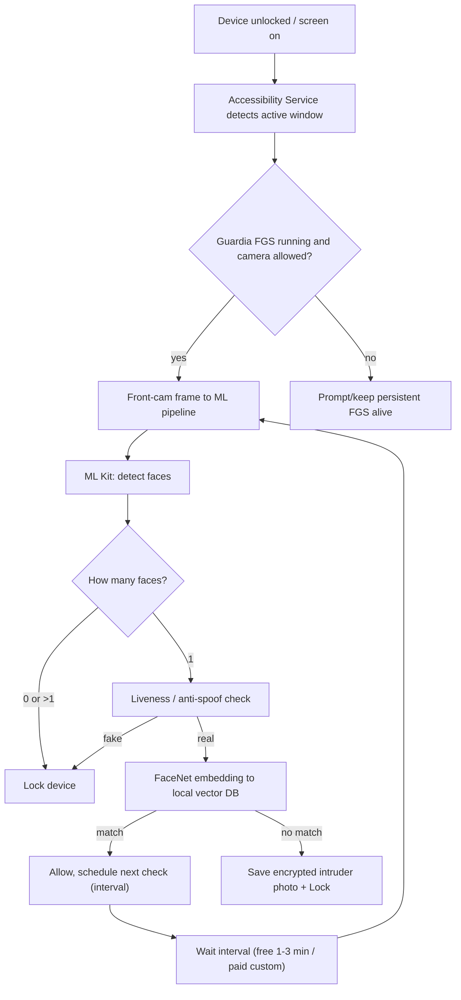
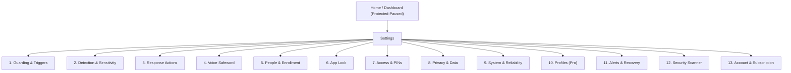
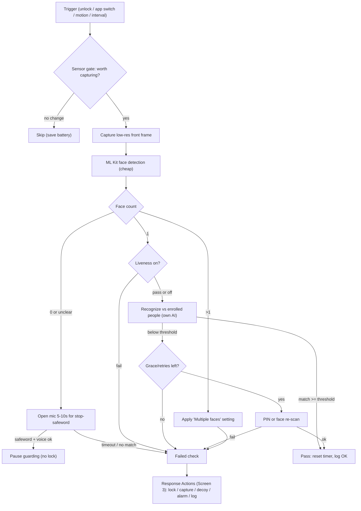

# Guardia - Android Security App Plan

A privacy-first, on-device AI guard for Android. Guardia continuously verifies *who* is holding the phone (face + voice), and locks/defends the device when an unauthorized person is detected. No faces, photos, or biometric data ever leave the device - servers only handle accounts, subscriptions, and licensing.

Per your decisions: **full feature set is the priority** (primary distribution via your own site / sideload + APK, with an optional Play Store "lite" later), and **intruder photos are stored locally only, encrypted, auto-deleted after N days**.

---

## 1. Refined product vision (what we actually do)

Guardia is a **continuous identity guard**, not just an intruder-selfie tool. The difference vs. competitors: existing apps only react to *wrong PIN attempts*. Guardia verifies the **live operator's identity even after a correct unlock** - catching the case where someone hands the phone over, shoulder-surfs the PIN, or grabs an already-unlocked phone.

Three layers of defense:
- **Layer 1 - Access control:** 3 PINs (real / decoy / panic-wipe). **PIN-only - no fingerprint/biometric to open Guardia itself** (the app must stay accessible even when the owner's biometric is unavailable, and we never want the system biometric to gate our own management UI).
- **Layer 2 - Continuous presence check:** periodic on-device face verification while the phone is in active use; locks on unknown/empty/multiple faces. **This uses our own AI models, not any Android face API** (see note below).
- **Layer 3 - Voice safeword (start/stop only):** the owner's voice + secret phrase is used **solely to start/stop the background face guarding** - nothing else. It works **even when the app is not open**. Its most important job is as a **graceful fallback**: when a face check is inconclusive (e.g. it's dark, or the camera can't get a clean read), Guardia opens the mic for ~5-10s and listens for the stop-phrase before it locks - so the owner can say the word and avoid a false lock instead of being kicked out.

Plus **App Lock** (per-app PIN gate) as a bundled high-value feature.

> Important platform fact: **Android does not expose a face-recognition API to apps.** The system biometric (Face Unlock / `BiometricPrompt`) only answers "is this the device owner, yes/no" for unlocking - it cannot tell us *who* a face is, cannot enroll multiple people, and cannot be queried in the background. Therefore Guardia ships its **own face-recognition AI and matching logic** (ML Kit only for *detecting* face bounding boxes; recognition is our own MobileFaceNet pipeline). This is core to the product, not a workaround.

---

## 2. The hard technical reality (this reshapes the flow)

Your original flow assumes silent camera capture every 1-3 min "in the background." Android does **not** allow this directly:

- The `CAMERA` permission is **while-in-use** only. An app **cannot start a camera foreground service while it is in the background** - it throws `SecurityException` ([Android docs](https://developer.android.com/develop/background-work/services/fgs/restrictions-bg-start)). You also can't start it from a `BOOT_COMPLETED` receiver.
- On Android 14+ you must declare `FOREGROUND_SERVICE_CAMERA` + `foregroundServiceType="camera"` and call `startForeground(..., FOREGROUND_SERVICE_TYPE_CAMERA)` ([FGS types](https://developer.android.com/develop/background-work/services/fgs/service-types)).

### What this means in practice
Guardia must run as a **persistent foreground service started while a Guardia activity is visible** (i.e., on first launch after setup), kept alive with a visible/ongoing notification. To know *when* to re-check (i.e., when the active app/screen changes), we pair it with an **Accessibility Service** that observes window/screen-state events - this is the legitimate, documented way to react to "device is now being used" without polling the camera blindly.

### Start / Stop control (master switch)
A clear **Start/Stop guarding** control is the primary action in the app, surfaced in 3 places:
- **In-app master toggle** on the home screen (big, obvious "Protected / Paused" state).
- **Ongoing notification action** (Pause/Resume) from the persistent foreground-service notification.
- **Quick Settings tile** (`TileService`) for one-tap toggle from the system shade.
Stopping guarding requires the **real PIN** (so an intruder can't just disable it). State is persisted so it survives process death and reboot.

### Auto-start after power off/on (reboot)
We register a `RECEIVER_EXPORTED` `BOOT_COMPLETED` receiver to relaunch guarding after reboot. Nuance to respect the platform: a **camera** foreground service **cannot** be started directly from `BOOT_COMPLETED`. So on boot we:
1. Start a **persistent foreground service of a non-camera type** (e.g. `specialUse`/`dataSync`) that holds the "guarding armed" state + the Accessibility hook.
2. **Arm the camera capture lazily** - the first time the user unlocks/interacts (a visible window event), we transition into camera capture. This satisfies the while-in-use rule while still meaning "Guardia is back on automatically after a restart." We also re-prompt only if a required permission was lost. (OEM battery managers may kill this - see Risks; we add an in-app "ensure autostart works on your phone" helper per manufacturer.)

**Key honest limitation to set expectations:** truly silent, screen-off, indefinite background camera capture is not reliably possible on modern Android without device-admin/MDM or OEM allowlisting. The realistic model is: **continuous checks while the screen is on and the device is in active use**, anchored by the persistent foreground service. This is still far beyond what any competitor does. (This is one reason your choice to prioritize full features via sideload is the right call.)

### "Lock the device" mechanism
- Use the **Device Admin API** `DevicePolicyManager.lockNow()` to force the secure lock screen. This requires the user to grant Device Admin (a standard, transparent prompt). This same API also powers the optional panic-wipe (`wipeData()`).

### Intruder selfie on wrong unlock (PIN / password / pattern)
- With **Device Admin** granted, Guardia's `DeviceAdminReceiver.onPasswordFailed()` fires on each failed *system* unlock attempt (the classic competitor mechanism, e.g. Third Eye). We use it to log the event (time + attempt count) and trigger a capture.
- **Honest reliability caveat:** grabbing a front-camera frame *at the lock screen* on Android 14+ is the hard part - apps cannot freely open the camera from the background. The realistic implementation uses our already-running foreground service plus a brief `SYSTEM_ALERT_WINDOW` overlay to obtain momentary foreground and capture. This works on many devices but is **not guaranteed on every OEM/lock type** (newer Pixels are strict). We ship it as best-effort, clearly labeled, and always at minimum record the failed-attempt event even when the photo can't be taken.
- Configurable: capture after the **Nth** failed attempt (default 1), front/rear, single/burst; stored encrypted locally per the retention setting.

### Microphone for the voice fallback
- The voice safeword needs the mic. On Android 14+ this means declaring `FOREGROUND_SERVICE_MICROPHONE` + `foregroundServiceType="microphone"` and the `RECORD_AUDIO` runtime permission, with the same while-in-use rule as camera. Because the mic window is only opened during the short fallback listen (or in optional always-listen mode), our persistent foreground service declares **both `camera` and `microphone`** types and arms each only when needed.

### Battery optimization architecture (this is critical)
Continuous camera + ML is the heaviest cost, so the engine is built to **spend the camera as rarely as possible** while still feeling continuous:
1. **Sensor-gated capture (biggest win):** don't capture on a blind timer. Use *cheap* signals to decide *when* a frame is worth taking - screen-on, **foreground-app change** (Accessibility), **device motion / significant-motion sensor**, proximity (in-pocket -> skip), ambient light. If nothing changed since the last successful check, defer.
2. **Two-stage vision:** run cheap **ML Kit face *detection*** first (low-res, fast). Only if a face is present do we run the heavier **MobileFaceNet embedding + MiniFASNet liveness**. No face / pocket -> near-zero cost.
3. **Low-res, single-frame capture** at the lowest resolution that recognizes reliably; downscale before inference.
4. **Hardware acceleration:** NNAPI/GPU delegate for TFLite (quantized FP16 models), selectable via Performance mode.
5. **Adaptive cadence / back-off:** after repeated consecutive passes in a stable context, lengthen the interval automatically; tighten again on any change event.
6. **Context relaxation:** trusted Wi-Fi/BT/location/charging -> longer intervals or pause (Screen 1.5).
7. **Screen-off = no camera work** (can't capture anyway); only sensors/light run.
8. **Min-interval cap** guarantees a battery floor regardless of triggers.
Target: in a typical session the camera fires on *meaningful events* (unlock, app switch, motion), not a fixed 1-min grind - dramatically lower drain than a naive timer.

---

## 3. Competitive landscape (research findings)

The "intruder selfie" category exists but is shallow and reactive:
- **CrookCatcher** - 10M+ downloads; wrong-PIN selfie, GPS, email alerts, video (PRO), fake home screen, hidden icon, blocks power menu via Accessibility. The most feature-complete competitor.
- **Third Eye - Intruder Detection** - photo on wrong PIN via Device Admin "monitor unlock attempts"; reviews show reliability problems on newer Android/Pixel.
- **Intruder Selfie Alert / Lockwatch / WTMP / Spy Selfie** - variations on wrong-PIN photo + email/Drive.

**The gap Guardia fills:** every competitor only triggers on *failed unlock*. None do **continuous on-device face *recognition* of the active user after a successful unlock**, none combine **voice-safeword control**, and none position around **strict on-device privacy (no biometric data on servers)**. That trio is our differentiation. Beyond it, Guardia **matches CrookCatcher's parity features** (email/push alerts, find-my-phone, video capture, fake home screen, hidden icon, anti-shutdown blocking) **and adds an on-device security/malware-hygiene scanner** - bundling intruder defense + device threat hygiene in one privacy-first app, which no single competitor does.

Adjacent (not competitors, but context): Android's built-in **Theft Detection Lock, Identity Check, Offline Device Lock** (2024-2026) cover *theft/snatch* scenarios but not "who is using my unlocked phone right now."

---

## 4. On-device AI stack (no servers for biometrics)

Fully feasible offline in 2026 (validated against working open-source reference [OnDevice-Face-Recognition-Android](https://github.com/shubham0204/OnDevice-Face-Recognition-Android)):

- **Face detection:** Google **ML Kit Face Detection** (BlazeFace-based) - on-device, multi-face, landmarks, real-time.
- **Face recognition:** **MobileFaceNet** (TFLite), 512-d embedding per face; compare via cosine similarity to enrolled embeddings.
- **Liveness / anti-spoof:** **MiniFASNet** (Silent-Face-Anti-Spoofing) dual-scale TFLite models, ~10-30ms inference; ~90% vs printed photos, ~85% vs screens. Critical so a printed photo can't defeat the guard.
- **Vector store:** **ObjectBox** (on-device vector DB) for enrolled-face embeddings + nearest-neighbor search.
- **Voice safeword:** on-device keyword spotting + speaker verification. Options: TFLite speaker-ID model + a small KWS model; evaluate **Picovoice (Porcupine wake-word + Eagle speaker recognition)** which runs fully on-device. Safeword = correct phrase AND owner's voiceprint.

All embeddings/voiceprints are stored **encrypted on-device** (Android Keystore-backed key + EncryptedFile/SQLCipher). Nothing biometric is uploaded.

---

## 5. Refined feature flow (improved version of your draft)

1. **Onboarding & registration** - account (email/phone) for subscription/licensing only. Free vs Paid tier selected here.
2. **Triple-PIN setup** (with improvements):
   - **Real PIN** -> full app + management.
   - **Decoy PIN** -> opens a believable decoy (simple game/calculator) AND silently flags "coerced" state (captures an intruder photo, optionally logs).
   - **Panic PIN** -> triggers Device Admin `wipeData()`. **Strong recommendation:** add a confirmation/delay + clear opt-in during setup, because an instant-irreversible-wipe-on-PIN is the single biggest abuse/liability risk. Keep it, but gate it.
3. **Enrollment - persons list** - enroll multiple authorized faces (multi-angle capture for accuracy) + optionally a voice safeword per person.
4. **Active guarding (background capture, sensor-gated):**
   - Guardia takes front-camera frames and runs the check **in the background while the device is in use**, but capture is **event/sensor-gated** (unlock, app switch, motion) rather than a blind timer, for battery (see Section 2 battery architecture).
   - Lock if: no face, >1 face, spoof detected, or no match.
   - **Inconclusive check (dark / poor read) -> voice fallback first:** before locking, open the mic for ~5-10s and listen for the **stop-safeword**; if the owner says it (phrase + voiceprint match), pause guarding instead of locking. Otherwise proceed to the failure action.
   - Re-check on the configured cadence (Free: 1-3 min presets; Pro: custom + continuous-while-on).
   - **Unknown-but-maybe-authorized handling:** on no-match, capture an **encrypted local intruder photo**, lock, and add it to an in-app **"Unknown faces" review list** so the owner can later tap "This is me/authorized" to improve recognition (incremental enrollment). Photos are **local-only, encrypted, auto-deleted after N days** (default 7).
5. **Intruder selfie on wrong unlock** - on a failed system PIN/password/pattern attempt (Device Admin `onPasswordFailed`), log the attempt and best-effort capture a photo of who's trying to get in (see Section 2 caveat).
6. **Start/Stop guarding** - master toggle (in-app + notification + Quick Settings tile), protected by the real PIN; auto-restores after reboot.
7. **Voice safeword (start/stop only)** - say the phrase to start or stop background face guarding, hands-free, even when the app isn't open; also used as the inconclusive-check fallback above.
8. **App Lock** - per-app PIN gate via the same Accessibility service.
9. **Settings** - see the dedicated, deep settings system in Section 5a.

### Improvement ideas worth adding
- **Trusted context** (relax checks on trusted Wi-Fi/Bluetooth/location) to cut battery + false locks.
- **Grace re-auth:** on a single failed match, allow a quick **PIN or face re-scan** before hard lock (reduces frustration from ML false negatives). No fingerprint involved.
- **Battery-aware scheduling** and a clear ongoing notification (required for FGS anyway).
- **Tamper resistance:** detect uninstall attempts / Device Admin removal and lock first (Accessibility-assisted, like CrookCatcher's power-menu blocking).
- **Stealth UX (optional, distribution-dependent):** disguised icon/name - high Play risk, fine for sideload build.

---

## 5a. Settings - exact screen spec + behavior for every variation

This section defines the **complete settings UI** screen-by-screen, every control's options and default, whether it's Free or Pro, and **exactly how the software behaves for each value**. Notation: `[toggle]` on/off switch, `(picker)` single choice, `(multi)` multi-select, `<slider>` numeric, default in **bold**.

### Navigation map

### Home / Dashboard (not Settings, but the control surface)
- **Big status card:** PROTECTED (green) / PAUSED (amber) / NEEDS ATTENTION (red, e.g. a permission was revoked).
- **Start/Stop button** (the master switch). Tapping Stop -> requires real PIN -> guarding pauses; status card turns amber and the ongoing notification shows "Paused".
- **Quick stats:** last check time, checks today, unknown-face captures count (badge).
- **Active profile** chip (Pro). Shortcuts: People, Unknown faces, Settings.

---

### Screen 1 - Guarding & Triggers (the heart of the app)
A **rules engine**: guarding = an ordered list of trigger rules. The engine evaluates them and fires a face check when any active rule's condition is met. If a frame is captured, it always runs the full pipeline (detect -> liveness -> recognize) and then applies Response Actions (Screen 3).

**1.1 Master cadence**
- **Check mode** (picker): **Interval** / Continuous-while-screen-on (Pro) / Event-only / Manual-only.
  - *Interval:* timer fires every N. Free presets only: **1 min** / 2 min / 3 min. Pro: custom 10s-60min.
  - *Continuous-while-screen-on (Pro):* re-checks as fast as the min-interval cap allows whenever screen is on and app in active use.
  - *Event-only:* no timer; only the event/per-app rules below fire checks.
  - *Manual-only:* checks only when user taps "Check now" (mostly for testing).
- **Minimum interval cap** <slider> 10s-5min (**30s**) - battery floor; the engine never checks more often than this regardless of other rules.

**1.2 Event triggers** (each a `[toggle]`, default in bold)
- Check **on every unlock** - **ON**. Behavior: first check fires within ~1s of the unlock window event.
- Check **on screen-on** (even before unlock if a Guardia activity is visible) - OFF.
- Check **when returning to foreground from another app** - OFF.
- Check **after inactivity then activity** - OFF, with `<slider>` inactivity threshold 1-30 min (**5 min**).
- Check **on charging connect/disconnect** - OFF (useful "someone unplugged it" signal).

**1.3 Per-app triggers (your key request)**
- `[toggle]` **Enable per-app guarding** - OFF by default.
- **App list:** pick apps (multi). For each selected app, configure:
  - **On open** (picker): Check once / Check then re-check every N sec `<slider 5-300s>` / No check.
  - **While in foreground** (picker): **Re-check every N sec** / Check once only / Continuous.
  - **On failed check in this app** (picker): **Lock whole device** / Lock just this app (return to launcher + App-Lock gate) / Capture only + warn.
  - **Strictness override** (picker): Use global / Stricter / Lenient (overrides Screen 2 threshold for this app).
- **App categories shortcut:** "Guard all Finance/Banking apps," "Guard all Messaging," etc. (maps to package lists).
- **Behavior:** the Accessibility service reports the current foreground package; when it matches an enabled app, the per-app rule supersedes the global cadence for as long as that app is foreground.

**1.4 App blocklist (never guard)**
- (multi) apps where checks are suppressed (e.g. **Camera, Phone/Dialer, Maps navigation**). Prevents the front camera fighting with apps that need it. Default seeds: system Camera + Dialer.

**1.5 Context modifiers** (Pro) - relax or tighten based on environment. Each rule: condition -> effect (Relax / Tighten / Pause / Force-continuous).
- **Trusted Wi-Fi** (multi SSIDs), **Trusted Bluetooth** (multi devices, e.g. car/watch), **Trusted location** (geofence), **Time of day** (schedule), **Charging state**.
- *Relax* = multiply interval x N and/or lower strictness; *Tighten* = shorten interval + raise strictness; *Pause* = no checks; *Force-continuous* = continuous mode.
- Conflict rule: **Tighten always wins over Relax** when multiple match (fail-safe).

---

### Screen 2 - Detection & Sensitivity
- **Recognition threshold** <slider> Lenient <-> **Balanced** <-> Strict. Maps to a cosine-similarity cutoff. Behavior: Strict = fewer false accepts, more false locks (good in public); Lenient = fewer annoying locks, higher risk. Show a live "test your face" meter.
- **Liveness / anti-spoof** (picker): Off / **On (balanced)** / On (strict). On = a printed photo or screen replay of an authorized person is rejected as spoof -> treated as a failed check. Strict adds latency.
- **On multiple faces** (picker): **Lock** / Warn only / Ignore. (Default Lock = "someone is looking over your shoulder.")
- **On no face detected** (picker): **Grace then act** / Lock immediately / Ignore. "Ignore" is for users who set the phone down a lot.
- **Grace window** <slider> 0-30s (**8s**) + **Retries before hard action** <slider> 1-5 (**2**). During grace, Guardia re-checks; if it then sees an authorized face, no lock.
- **Re-auth method on borderline fail** (picker): **PIN** / Face re-scan only / None (hard lock). (No fingerprint, per your requirement.)
- **Low-light handling** (picker): **Skip check (don't false-lock)** / Use screen as fill light / Lock. Behavior decided when ML Kit confidence is low due to darkness.
- **Camera used for checks** (picker): **Front** / Front+Rear alternate (rare).

---

### Screen 3 - Response Actions (what happens on a failed check)
Configurable per outcome type. Each outcome maps to one or more actions.
- **Primary action** (picker): **Lock device** (`lockNow()`) / Lock + capture / Open decoy app / Sound alarm / Silent log only.
- **Capture on failure** `[toggle]` **ON** -> saves an **encrypted, local-only** intruder photo (auto-deleted per Screen 8).
  - **Capture source** (picker): **Front** / Front+Rear / Rear.
  - **Capture amount** (picker): **Single frame** / 3-frame burst / 3s clip (Pro).
- **Alarm** `[toggle]` OFF -> loud sound + optional on-screen "This device is protected" message; volume/duration sliders.
- **Decoy on failure** `[toggle]` OFF (Pro) -> instead of locking, drop into the decoy environment (see Screen 7) to mislead an intruder.
- **Notify owner** `[toggle]` ON -> local high-priority notification logged to the event timeline (no network).
- **Wrong-unlock capture** `[toggle]` ON -> capture on failed system PIN/pattern/password via Device Admin (`onPasswordFailed`); config: after Nth attempt (**1**), front/rear, single/burst. Best-effort per Section 2 caveat.
- **Escalation ladder** (Pro): 1st fail -> grace/re-auth; 2nd -> lock+capture; 3rd within X min -> alarm/decoy. Each rung configurable.

---

### Screen 4 - Voice Safeword (start/stop only)
The safeword has **one job: start or stop the background face guarding**, hands-free, even when the app is not open. Verified fully on-device (phrase match AND speaker voiceprint must both pass). It is **not** used for unlocking, panic, or anything else.
- `[toggle]` **Enable voice safeword** - OFF until enrolled.
- **Enroll voiceprint** - record each phrase 3-5x; stores an encrypted speaker embedding (Picovoice Eagle / TFLite speaker model). Per-person (links to People, Screen 5).
- **Stop phrase** - user-defined secret phrase that **stops/pauses** guarding (matched via on-device KWS/wake-word).
- **Start phrase** (picker): **Same phrase toggles** / Separate start phrase.
- **Inconclusive-check fallback** `[toggle]` **ON** - when a face check can't get a clean read (dark/no face), open the mic for a listen window and wait for the stop phrase before locking.
  - **Listen window** <slider> 3-15s (**8s**).
  - Behavior: owner says stop phrase + voiceprint matches -> guarding pauses (no lock); window elapses with no valid phrase -> run the normal failure action (lock/capture).
- **Listening mode** (picker): **Only during the fallback window** (most battery-friendly, default) / While screen on / Always-listening even when app closed (Pro, higher battery, honest FGS/battery caveat).
- **What "stop" does** (picker): **Pause until I say start** / Pause for duration `<slider 1-120 min>` / Pause until next unlock.
- **Speaker-match strictness** <slider> (reject other people saying the phrase).
- **Failsafe** `[toggle]` ON: if the phrase can't be voice-verified (e.g. someone plays a recording), it's ignored and falls back to the normal action / real PIN - a recording of your voice alone can't disable protection.
- **Behavior summary:** correct phrase + matching voiceprint -> start/stop guarding; wrong phrase OR wrong voice -> ignored (optionally logged as a tamper event).

---

### Screen 5 - People & Enrollment
- **People list:** add / edit / remove authorized persons. Each person:
  - **Face samples:** capture 5-15 multi-angle shots; "Add more samples" improves accuracy; shows a quality score.
  - **Re-train / recompute embeddings** button.
  - **Voice safeword** per person (links Screen 4).
  - **Role** (picker): Owner (full) / Authorized (passes checks only). Only Owner-role can manage settings.
- **Unknown faces review:** grid of captured unknown faces; tap one -> "This is me/authorized" -> assign to an existing person or create new (incremental enrollment improves future recognition). Or delete.
- **Behavior:** recognition compares the live embedding against all enrolled people; match to any authorized person = pass.

---

### Screen 6 - App Lock
- `[toggle]` **Enable App Lock**.
- **Locked apps** (multi). For each: gate with **real PIN** when opened (no fingerprint).
- **Re-lock timing** (picker): **Immediately on leave** / After 30s / After 1 min / Until screen off.
- **Combine with face check** `[toggle]`: also run a face check when a locked app opens (overlaps with Screen 1.3; if both set, face check + PIN both required - choose AND/OR).
- **Behavior:** Accessibility service detects the locked package opening and overlays the PIN gate before content is shown.

---

### Screen 7 - Access & PINs
- **Real PIN** - change (requires current real PIN).
- **Decoy PIN** `[toggle]` + set. **Decoy content** (picker): Calculator / Simple game / Fake home screen / Custom app. Behavior: entering decoy PIN opens the decoy and silently flags "coerced" (optional capture + log), while real data stays hidden.
- **Panic PIN** `[toggle]` (default OFF, gated) + set. **Panic action** (picker): Wipe app data only / Factory reset (Device Admin `wipeData()`). **Mandatory confirmation:** a second confirm screen + a `<slider>` delay (0-10s) cancel window. Strong warnings; opt-in only.
- **Tamper guards** (each `[toggle]`):
  - Require real PIN to **open Settings** (**ON**), to **Stop guarding** (**ON**), to **uninstall / remove Device Admin** (ON, Accessibility-assisted).
  - **Block power menu / quick settings on failed-check lock screen** (Pro, experimental) to stop shutdown/airplane-mode evasion.
- **Hidden app icon** `[toggle]` (sideload build only) - launch via dial-code or chosen alias.

---

### Screen 8 - Privacy & Data
- **Intruder photo retention** (picker): 1 / **7** / 30 days / Until manually deleted. Auto-purge job enforces it.
- **Store intruder photos** `[toggle]` ON; **Store event log** `[toggle]` ON. Off = capture nothing, only lock.
- **Encryption status** (info): shows Keystore-backed encryption active.
- **Export** (Pro): export your own captures (decrypted) to a chosen folder.
- **Panic purge now** button - wipes all local captures/logs/embeddings (not the account).
- **Reassurance copy:** "No faces, photos, voiceprints, or logs ever leave this device."

---

### Screen 9 - System & Reliability
- **Auto-start on boot** `[toggle]` **ON** - relaunch guarding after reboot (lazy camera arming as described in Section 2).
- **Per-OEM helper** - detects manufacturer (Xiaomi/Samsung/Oppo/Vivo/Huawei...) and deep-links to the relevant Autostart / Battery-unrestricted setting with step-by-step guidance. Shows a green/red "background reliability" health check.
- **Ignore battery optimizations** - prompt + status.
- **Foreground notification style** (picker): **Standard (visible)** / Minimal. (Cannot be fully hidden - required by Android for FGS.)
- **Quick Settings tile** `[toggle]` ON.
- **Performance** (picker): Battery-saver (longer intervals, CPU inference) / **Balanced** / Performance (GPU/NNAPI). Affects model delegate + cadence caps.
- **Self-test / diagnostics** - run the full pipeline once and report timings + permission status.

---

### Screen 10 - Profiles (Pro)
- Save the entire settings state as named **profiles**: e.g. **Home** (relaxed, longer interval, liveness off), **Public** (aggressive, strict, continuous), **Work** (per-app guarding for work apps).
- **Auto-switch rules:** bind a profile to a context (Trusted Wi-Fi/location/time) so it activates automatically; manual override from Home.
- Behavior: active profile's values replace the global settings while active; switching is instant and logged.

---

### Screen 11 - Alerts & Recovery
- **Intruder alerts** `[toggle]` - on an intruder/failed-unlock event, send the captured photo + time + coarse location.
  - **Channels** (multi): Email (device SMTP/intent) / Push / SMS to trusted contact. Free: email only; Pro: all.
  - **Trusted contacts** - add recipients; test-send button.
- **Find My Phone** (picker): **Use Android Find Hub** (recommended, deep-link + setup guide) / Guardia-native locate (opt-in).
- **On-demand locate** - "Send my location to a trusted contact now."
- **Auto-locate triggers** (multi): SIM change / repeated wrong unlocks / low battery / walk-away.
- **Remote SMS commands** `[toggle]` (opt-in) - set a secret keyword + allowed actions (lock / locate / alarm / capture); works with no data connection.
- **Anti-shutdown blocking** `[toggle]` (experimental) - block power menu / quick settings on the intruder lock screen.
- Behavior note: all delivery is device-originated; nothing is stored on Guardia servers (see 5b note).

### Screen 12 - Security Scanner (device threat & malware hygiene)
- **Run scan now** + **scheduled scan** (picker: Off / Daily / Weekly).
- **Security score** 0-100 with prioritized fixes.
- **Checks** (each `[toggle]`): App risk audit (dangerous permission combos) / Sideload & unknown-source detector / Stalkerware & hidden-app finder / Permission watchdog (new/background mic-cam-location use) / Network safety (open Wi-Fi, MITM, proxy/cert) / System integrity (root, ADB, dev options, unknown device-admins, Play Integrity).
- **Per-app risk list** - score + one-tap uninstall / revoke.
- **Licensed AV engine** `[toggle]` (Pro/Later) - enable true signature malware scanning via integrated on-device SDK (if shipped).
- Behavior: all analysis on-device; findings shown locally, optionally included in alerts.

### Screen 13 - Account & Subscription
- Sign-in/out, current plan (Free/Pro/Lifetime), manage subscription (Stripe/Paddle portal), restore purchase / enter license key, privacy policy + ToS links. No biometric data shown here (none exists server-side).

### How it all comes together (decision flow per check)

---

## 5b. Extended feature catalog (competitor parity + new ideas)

A menu to push Guardia past "intruder selfie" into a full personal-security suite. Tier as Free/Pro/Later during planning. Default stance stays **on-device**; where a feature needs network, we keep it **opt-in** and avoid storing biometric data server-side.

### A. CrookCatcher-class parity (table stakes)
- **Alert delivery** (intruder events): **email** and/or **push** with the captured photo, time, and coarse location. Delivery is **direct from the device** (SMTP/email intent) or an optional thin notification relay - **we never store the photo on our servers**; it's transmitted then kept only in the local encrypted log. (Pro: choose channels; Free: basic email.)
- **Video / audio capture (Pro)** - short clip instead of a single frame on an intruder event (extends Screen 3 capture amount).
- **Fake home screen / decoy** - already in Screen 7; add a customizable fake lockscreen message ("This device is protected & tracked").
- **Hidden / disguised app icon** - already in Screen 7 (sideload build).
- **Anti-shutdown blocking** - block power menu / quick settings / notification shade on the failed-check or intruder lock screen so a thief can't power off or enable airplane mode before evidence is captured (Accessibility-based, experimental per OEM - same approach CrookCatcher uses).
- **Reboot re-arm reminder** - if the OS requires an unlock after reboot before guarding fully re-arms, nudge the user.

### B. Find My Phone / anti-theft & recovery
- **Recommended approach (privacy-first):** lean on Android's built-in **Find Hub / Find My Device** for map/locate/wipe rather than building a tracking backend - it's more reliable and keeps us out of storing location. Guardia deep-links and guides setup.
- **Guardia-native locate (opt-in):** "Locate this device" sends the **current location to your own trusted contact/email on demand or on an intruder/SIM-change event** - device-originated, not stored by us.
- **Last-known-location on low battery** - fire a location message to your trusted contact when battery is critically low (common "phone about to die / stolen" recovery aid).
- **Remote commands via SMS (opt-in, password-protected):** owner texts a secret keyword to the device to lock / locate / sound alarm / capture - works even with no data connection. Strictly gated by a shared secret to avoid abuse.
- **Theft heuristics -> auto-lock + alert:** SIM change, repeated wrong unlocks, walk-away motion, removal of Device Admin.

### C. On-device threat & malware hygiene (new, differentiating)
Be honest about scope: a full signature-based antivirus needs a maintained threat DB / cloud and is a different product. Guardia instead ships a **privacy-respecting on-device security scanner** focused on the threats that matter for personal security, with an option to license a 3rd-party AV engine later for true malware signatures.
- **App risk audit** - scan installed apps and flag dangerous capability combos: apps holding **Accessibility + Device Admin + SMS + overlay + install-packages** (the classic stalkerware/banking-trojan fingerprint). Show a per-app risk score and one-tap uninstall.
- **Sideload / unknown-source detector** - flag apps **not installed from a trusted store** (installer package check) and apps from disabled-then-enabled unknown sources.
- **Stalkerware / hidden-app finder** - surface apps with **no launcher icon** or suspicious names, plus apps actively reading the screen/location/mic in the background.
- **Permission watchdog** - alert when an app **newly gains** camera/mic/location/SMS/accessibility, or when mic/camera are used in the background (Android 12+ indicators) by a non-allowlisted app.
- **Network safety checks** - warn on connecting to **open/unencrypted Wi-Fi**, captive portals, or when the device proxy/VPN/cert store looks tampered (MITM risk).
- **System integrity** - root/Magisk detection, USB-debugging/ADB-over-network on, developer options, unknown device-admins, screen-overlay abuse, **Play Integrity** verdict (Play build).
- **Optional licensed AV engine (Pro/Later)** - integrate a third-party on-device malware SDK for real signature scanning if we want to claim "antivirus." Evaluate licensing + size impact; keep scanning on-device.
- **Security score & advice** - a single 0-100 device-health score with prioritized fixes (like the dashboards users already trust).

### D. Privacy hardening
- **Encrypted personal vault** - hidden, PIN-gated vault for photos/files; only owner face + real PIN opens it.
- **Screen-capture & mirroring guard** - `FLAG_SECURE` on chosen sensitive apps/screens; alert on cast/screen-mirror start.
- **Clipboard / autofill guard** - warn when sensitive fields are read while an unrecognized face is present.
- **Honeypot/decoy data** - planted fake credentials/photos that trigger alert + capture if opened in decoy mode.
- **Time-fenced access** - device usable only during owner-defined hours; otherwise require face + PIN.

### E. Already-covered (cross-reference)
- Failed-unlock intruder selfie + attempt log (Section 2 / Screen 3), silent duress alert, SIM-change detection, walk-away/proximity relock, fake shutdown, tamper/anti-removal hardening, shoulder-surfing alert.

> Note on email/locate features vs the "no servers" promise: the promise is specifically about **biometric data and intruder media never being stored on our servers**. Alerts and locate are **device-originated and user-configured** (your email, your trusted contact, Android's own Find Hub). If we ever add a convenience relay, it stays a transient pass-through with no retention - to be confirmed as a product decision.

---

## 5c. Future / R&D backlog (full idea set)

Forward-looking ideas to extend Guardia into a defensible personal-security platform. Tags: `[F]` Free, `[P]` Pro, `[L]` Later/R&D; distribution: `Play-safe` or `sideload` (Play-risky). Most are post-MVP; the highest-leverage differentiators are marked **HL**.

### Smarter detection & AI
- **Gait / motion biometrics** `[P][L]` **HL** Play-safe - passive accelerometer+gyro signature; relax/tighten face checks based on gait match (battery-cheap, camera-free).
- **Behavioral biometrics** `[P][L]` Play-safe - typing rhythm, swipe/scroll, touch pressure as a between-checks "is this the usual user" signal.
- **Adaptive owner learning** `[P]` Play-safe - refine embeddings from confirmed-good frames (consented) for beard/glasses/lighting drift.
- **Presence vs identity split** `[F]` Play-safe - cheap "any face?" most of the time; full identity match only on change.
- **Multi-modal fusion score** `[P][L]` **HL** Play-safe - combine face+voice+gait+behavior into one confidence score (fewer false locks).
- **Distress/forced-expression cue** `[L]` sideload - optional duress detection.

### Authentication & access
- **Trusted wearable unlock** `[P]` **HL** Play-safe - pause guarding while paired watch/band is on-body + nearby.
- **Knock/tap or volume-button secret code** `[P]` Play-safe - covert pause/unlock without screen.
- **Gesture safeword** `[P]` Play-safe - on-screen gesture equivalent of the voice safeword.
- **Duress face / second face** `[P]` sideload - enroll a distress face that triggers decoy + alert instead of unlocking.
- **One-time guest pass** `[F]` Play-safe - temporary code to lend the phone for N minutes without locking.

### Anti-theft & recovery (beyond current)
- **Theft incident report** `[P]` Play-safe - auto-compile photos + locations + events into a shareable report for police.
- **Movement/route breadcrumbs** `[P]` Play-safe - local location trail after a theft trigger (opt-in).
- **Loud "stolen device" mode** `[F]` Play-safe - siren + flashlight strobe + TTS announcement.
- **Pre-theft grab trigger** `[P]` Play-safe - sudden-motion + face-loss = instant lock.
- **Dead-man's switch** `[P][L]` sideload - no check-in within X hours -> escalate (lock/alert/optional wipe).

### Privacy & data protection
- **Per-app privacy curtain** `[P]` **HL** Play-safe - blur/hide notification content + app thumbnails when an unrecognized face is present.
- **Sensitive-notification masking** `[P]` Play-safe - hide message/OTP previews unless owner's face detected.
- **Incognito/panic hide** `[P]` sideload - instantly hide chosen apps/photos/files behind the vault on a gesture.
- **Auto-lock on screenshot/screen-record** of sensitive apps `[P]` Play-safe.
- **Sensor-access dashboard** `[F]` Play-safe - history of which apps used mic/camera/location (ties to scanner).

### Family / multi-device (privacy-careful)
- **Family plan** `[P]` Play-safe - one subscription, multiple devices, local per-device data (no central biometric store).
- **Parental/guardian mode** `[P]` sideload - alert a guardian if an unknown face uses a child's phone (requires consent/transparency to avoid stalkerware classification).
- **Cross-device settings sync** `[P][L]` Play-safe - E2E-encrypted sync of *settings only*, never biometrics, across the user's own devices.

### UX, trust & engagement
- **Weekly protection report** `[F]` **HL** Play-safe - checks, locks, intruders, battery, security-score trend.
- **"Test it now" onboarding simulator** `[F]` Play-safe - friend tries the phone to trigger the aha moment.
- **Transparency / privacy-proof screen** `[F]` **HL** Play-safe - live "no network calls with your face" indicator; consider open-sourcing the ML components.
- **Real-time battery-impact meter** `[F]` Play-safe.
- **Accessibility-friendly modes** `[F]` Play-safe - for users who can't reliably use face/voice.

### Monetization & growth
- **Family / Lifetime-family tiers**, **referral rewards** (free Pro months), **student/journalist discounts** `[P]`.
- **Pay-once add-on packs** (Security Scanner Pro, Anti-Theft Pro) for subscription-averse users `[P]`.
- **White-label / B2B SDK** `[L]` **HL** - license the on-device recognition+guarding engine to MDM vendors, banks, OEMs (largest long-term revenue lever).

### Platform & integrations
- **Tasker/automation intents** `[P]` Play-safe - power-user love.
- **Wear OS companion** `[P]` Play-safe - intruder alerts + remote lock from the watch.
- **Home-network awareness** `[P]` Play-safe - relax at home, aggressive on unknown networks.
- **Quick-tile panic + guest-mode shortcuts** `[F]` Play-safe.

### Emerging / defensible
- **On-device LLM security assistant** `[L]` **HL** Play-safe - small local model explains alerts, recommends settings, answers "is this app safe?" with no cloud.
- **Challenge-response liveness (anti-deepfake)** `[P][L]` Play-safe - blink/turn challenge for high-security profile.
- **Decoy network honeytokens** `[L]` sideload - fake credentials that signal compromise if exfiltrated.

> Caution flags: parental/guardian monitoring, duress face, incognito-hide, and dead-man's-switch sit near **stalkerware/Play-policy lines** - ship them in the sideload build with explicit consent + transparency, keep them out of the Play "lite" build. Gait/behavioral fusion, trusted-wearable, privacy curtain, and the local LLM assistant are the most novel defensible bets.

---

## 6. Privacy, compliance & distribution

- **Privacy posture is a feature:** "Your face never leaves your phone." Publish a clear privacy policy; only account/subscription data is server-side.
- **Play Store risk (why we go sideload-first):** Decoy mode, hidden icon, and PIN-to-wipe trip Google Play's **Deceptive Behavior** ("no hidden/undocumented features") and **Device & Network Abuse** policies. Per your decision, primary distribution is **direct download / sideload (signed APK on your own site)**, which legitimately allows these features with proper consent screens.
- **Two-build strategy (recommended even under "full features"):** a **Full build** (sideload, all features) and later an optional **Play "lite" build** (drops decoy/wipe/hidden-icon, keeps face guard + app lock) for reach + credibility. Same core engine, feature-flagged.
- **Consent & reversibility:** every sensitive capability (Device Admin, Accessibility, camera, mic, wipe) gets an explicit, documented consent screen. Wipe requires extra confirmation.

---

## 7. Target audience

- **Primary:** privacy-conscious individuals who lend/leave phones around (parents, partners, students, shared-household users).
- **High-value niches:** journalists, activists, executives, lawyers, healthcare workers handling sensitive data, people in high-coercion contexts (the decoy/panic features speak directly to them).
- **Prosumer/security enthusiasts** who actively sideload and want max control - this group maps perfectly to your full-features/sideload strategy.
- **Future B2B/MDM:** SMBs wanting lightweight device-use verification (later phase).

---

## 8. Business plan & monetization

- **Model:** Freemium subscription (server tracks entitlements only).
  - **Free:** face guard with fixed 1-3 min interval, single authorized face, basic lock, limited intruder-log retention.
  - **Pro (monthly/annual):** custom/aggressive intervals, multiple faces, voice safeword, App Lock, decoy mode, trusted-context, longer retention, panic-wipe, video/audio capture, multi-channel + SMS alerts, remote SMS commands, security scanner (full), encrypted vault, profiles.
  - **Lifetime** option (sideload audiences respond well to one-time licenses).
- **Billing:** Since primary channel is sideload (no Google Play Billing), use **Stripe / Paddle** for subscriptions + a **license-key/JWT entitlement** check at app start (works offline with periodic re-validation). Play "lite" build would use Play Billing if/when shipped.
- **Pricing hypothesis (validate):** Pro ~$2.99-4.99/mo or ~$24.99/yr; Lifetime ~$49.99. Competitors monetize via cheap PRO unlocks + ads; Guardia positions premium on continuous recognition + privacy.
- **Unit economics:** near-zero per-user infra cost (no biometric processing server-side) -> high margin; main costs are dev, model tuning, and support across device fragmentation.
- **Go-to-market:** privacy/security communities (Reddit r/privacy, XDA, Android forums), comparison content vs CrookCatcher/Third Eye, "continuous face guard" angle, security YouTubers.

---

## 9. Suggested build roadmap (Android first)

- **Phase 0 - Spike (de-risk the hard parts):** prove (a) persistent camera+mic FGS + Accessibility/sensor-gated capture + ML Kit/MobileFaceNet/MiniFASNet pipeline, (b) Device Admin `lockNow()`, (c) **wrong-unlock capture via `onPasswordFailed` + overlay** (the riskiest - measure reliability per OEM), and (d) the **mic listen-window fallback**, on 3-4 real devices/OEMs. Also baseline battery drain. *If (a) or (c) fail broadly, the product assumptions change - do this first.*
- **Phase 1 - Core MVP:** registration/entitlement, real PIN (PIN-only, no biometric entry), single-face enroll, Start/Stop master control + reboot auto-start, background sensor-gated face guard + lock + battery optimization layer, wrong-unlock intruder selfie, encrypted local intruder log w/ auto-delete, basic settings.
- **Phase 2 - Differentiators:** multi-face enroll + incremental "this is me" learning, the deep settings/trigger-rules engine (incl. per-app face checks), voice safeword (start/stop + inconclusive-check fallback), App Lock, trusted contexts, paid intervals, profiles.
- **Phase 3 - Advanced/sensitive + security suite:** decoy PIN/app, panic-wipe (gated), hidden icon, tamper resistance; CrookCatcher-parity (email/push/SMS alerts, find-my-phone via Find Hub, video capture, anti-shutdown blocking); and Section 5b ideas (duress alert, SIM-change detection, walk-away lock, fake shutdown, screen-capture guard, encrypted vault, time-fenced access).
- **Phase 3.5 - Security scanner:** on-device threat/malware-hygiene scanner (app risk audit, sideload/stalkerware detection, permission watchdog, network & integrity checks, security score); optional licensed AV engine evaluation.
- **Phase 4 - Reach:** Play "lite" build, polish, localization; groundwork for iOS/Windows/Linux later.

---

## 10. Top risks to track

- **Android background camera limits** (mitigated by FGS + Accessibility; still the #1 technical risk - Phase 0 must validate).
- **OEM fragmentation / aggressive battery killers** (Xiaomi, Samsung, etc. kill background services) - need per-OEM allowlist guidance.
- **ML false positives -> annoying false locks** - mitigate with grace re-auth + tunable thresholds + trusted context.
- **Liveness defeat** (spoofing) - layered checks, set honest expectations.
- **Legal/abuse exposure** of wipe + decoy features - consent gates, confirmations, clear ToS.
- **Distribution friction** of sideload (trust, updates) - signed APK, in-app updater, strong privacy messaging.